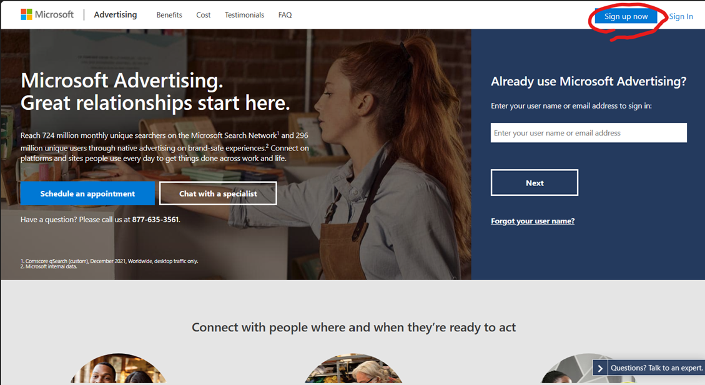
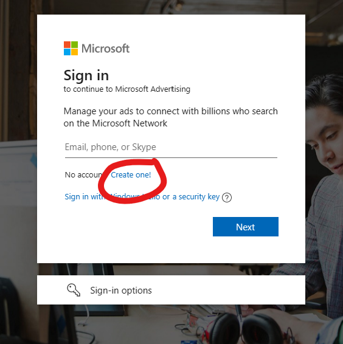
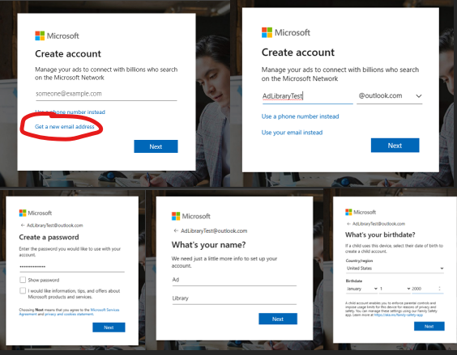
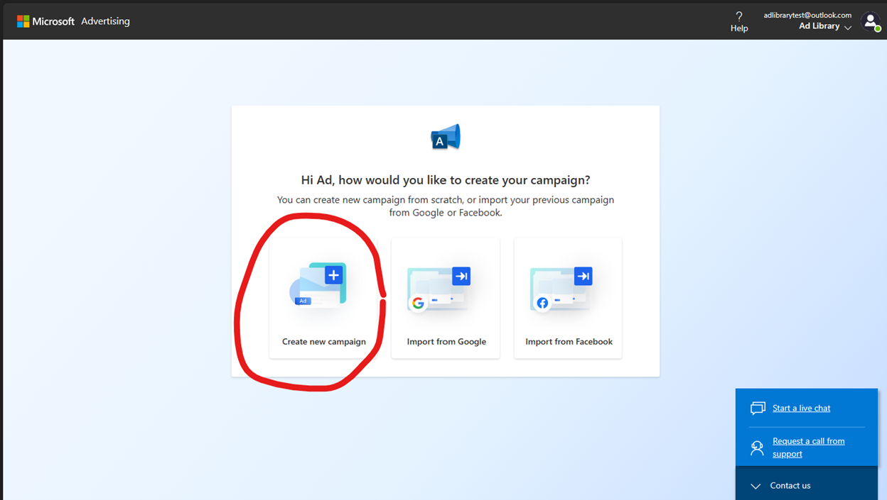
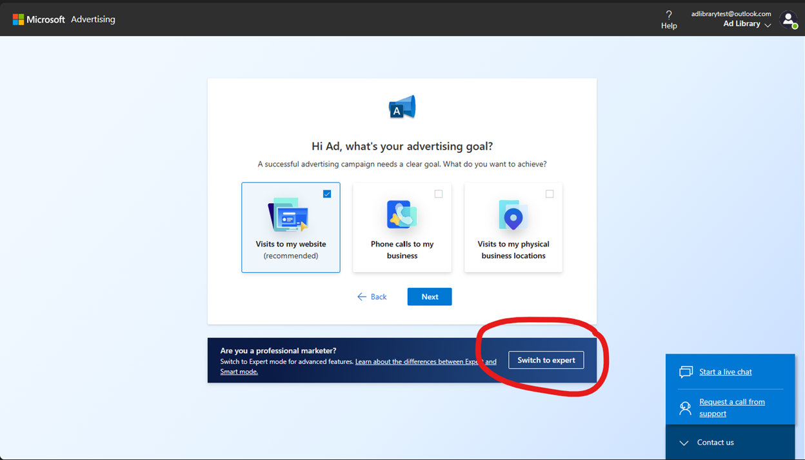
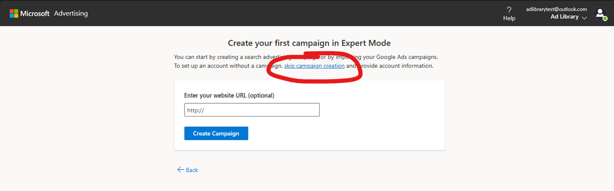
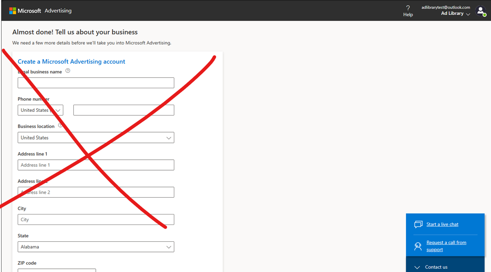

# Ad Library API Overview

The Ad Library is a public transparency tool that allows you to view all ads shown on Bing.com. You can search for ads by advertiser name and keywords present in the ad copy, and you will see both the ad content and additional ad details. The ad library is part of a compliance effort to ensure we are creating a safe and open internet for our users. 

## Ad Library API Resource

### Base URI

The following is the base URI that you append the templates to:

https://adlibrary.api.bingads.microsoft.com/api/v1/

### Templates

To create the endpoints used to query the Ad Library, append the appropriate template to the base URL:

| Template | HTTP Verb | Description | Resource
| ----------- | ----- | ------------------------- | -------------- |
| Advertisers | Get | Get Advertisers by Name  Parameters: - top (int32, default 3) - skip (int32, default 0) - searchText (string, default “”) | Array\<Advertiser> |
| Advertisers({AdvertiserId}) or Advertisers/{AdvertiserId} | Get | Get Advertiser by Id  Parameters: none  *Note*: AdvertiserId may be an AccountId or VerifiedAdvertiserId. Multiple accounts may be verified under the same identity. If a verified AccountId is requested the parent VerifiedAdvertiserId will be returned instead. | Advertiser |
| Ads  | Get | Get Ads by Advertiser/Content  Parameters: • top (int32, default 12) • skip (int64, default 0) • startDate (string) • endDate (string)     • Dates in format ‘yyyy-MM-dd’ • countryCodes (string)  Comma separated values, i.e. ’10,26,53’ • advertiserId (int64) • searchText (string) | Array\<Ad> |
Ads({AdId}) or Ads/{AdId} | Get | Get Ad by Id  Parameters: none | Ad |

### Data Objects

The following are the request and response objects used by the API:

| Object | Description |
| ----------- | ------------------------- |
| Advertiser | Defines an advertiser. |
| Ad | Defines an ad. |
| AdDetails | Defines additional details about an ad. |
| CountryImpressionShare | Defines ad impression share for a country. |
| TargetTypeDetails | Defines details about target types used by an ad. |

#### Advertiser

Defines an advertiser.

| Name | Value | Type |
| ----------- | ------------------------- | ------------ |
AdvertiserId | The ID identifying the advertiser.  *Note*: This may be an AccountId or a VerifiedAdvertiserId if the advertiser is verified. VerifiedAdvertiserIds may cover multiple accounts if the are verified under the same advertiser, and a request for an AccountId which has been verified will instead return the parent VerifiedAdvertiserId. | Long |
| AdvertiserName | The name of the account or legal name of a verified advertiser. | String |
| AdvertiserCountry | The country where the advertiser is registered. | String |
| IsVerified | A Boolean value representing whether the advertiser is verified. | Boolean |

#### Ad

Defines an ad.

| Name | Value | Type |
| ----------- | ------------------------- | ------------ |
| AdId | The ID identifying the ad. | Long |
| AdvertiserName | The name of the account or legal name of a verified advertiser. | String |
| AdvertiserId | The ID identifying the advertiser. | Long |
| Title | The title portion of the ad copy.  *Note*: For dynamic ad types, there may be multiple variations and the title, description, URLs, and assets may just be a recent, representative version from when the ad last served. | String |
| Description | The description portion of the ad copy. | String |
| DisplayUrl | The URL displayed by the ad, or the merchant name for certain ad types. | String |
| DestinationUrl | The actual URL linked to by the ad. | String |
| AssetJson | A JSON URL of the asset resource | String |
| AdDetails | An object containing additional details about an ad. | AdDetails |

#### AdDetails

Defines additional details for an ad.

| Name | Value | Type |
| ----------- | -------------------------------- | ------------ |
| PaidForByName | The name of the customer who paid for the ad if different than the account owner. | String |
| StartDate | The UTC date when the ad first ran, or when the first eligible impression was recorded by the Ad Library.  Note: The Ad Library only records ads impressions in the European Union (EU) or European Economic Area (EEA) since June 2023. The actual start date of an ad may predate the launch of our Ad Library or the date when the ad received its first eligible impression. | String |
| EndDate | The UTC date when the ad last ran, or when the last eligible impression was recorded by the Ad Library.  *Note*: In addition to the above note, there may be a 1-3 day delay in information appearing in the Ad Library, so the EndDate may not reflect newer impressions shown in the last few days if an ad is still active. | String |
| TotalImpressionsRange | A range representing the total number of impressions the ad has received in the EU and EEA. | String
| ImpressionsByCountry | A list of key-value pairs representing the percentage share of impressions for each EU or EEA member country. | array\<CountryImpressionShareObject> |
| TargetTypes | A list of target types used for ad targeting, and whether they were also used for exclusion.  *Note*: This is an aggregate list of all target types used at any point during the ad run for all eligible impressions and may not necessarily indicate which factors were used for a specific impression. | array\<TargetTypeDetails> |
| RestrictionReason | If present, the reason an ad has been restricted from serving further or displaying in the Ad Library. | RestrictionReason

#### CountryImpressionShare

Defines an ad’s impression share for a given country.

| Name | Value | Type |
| ----------- | -------------------------------- | ------------ |
| Country | A country where the ad was shown. | Country |
| ImpressionShare | The share of the ad’s impressions for the country, represented as a percentage (i.e., 17.3%). | String |

#### TargetDetails

Defines an ad’s impression share for a given country.

| Name | Value | Type |
| ----------- | -------------------------------- | ------------ |
| TargetType | The parameter used for targeting. | TargetType |
| UsedForExclusion | Denotes if the target type was also used for exclusion.  | Boolean |

### Value Sets

The following are the value sets used by the API.

| Object | Description |
| ----------- | -------------------------------- |
| Country | Defines the values of countries considered by the Ad Library for filtering and reporting ad impressions. |
| TargetType | Defines the types of targeting parameters tracked by the Ad Library. |
| RestrictionReason | Defines the reason an ad has been restricted from serving further or displaying in the Ad Library. |

#### Country

Defines the values of European Union countries and members of the European Economic Area considered by the Ad Library for filtering and reporting ad impressions.

| Name | Value |
| -------- | ----------- |
| Austria | 10 |
| Belgium | 14 |
| Bulgaria | 26 |
| Croatia | 49 |
| Cyprus | 207 |
| Czechia | 51 |
| Denmark | 53 |
| Estonia | 61 |
| Finland | 65 |
| France | 66 |
| Germany | 72 |
| Greece | 76 |
| Hungary | 88 |
| Ireland | 92 |
| Italy | 93 |
| Latvia | 104 |
| Lithuania | 108 |
| Luxembourg | 109 |
| Malta | 115 |
| Netherlands | 129 |
| Poland | 151 |
| Portugal | 152 |
| Romania | 226 |
| Slovakia | 165 |
| Slovenia | 167 |
| Spain | 170 |
| Sweden | 175 |
| Iceland | 89 |
| Liechtenstein | 107 |
| Norway | 139 |

#### TargetType

Defines the types of targeting parameters tracked by the Ad Library.

| Name | Value | Description |
| -------- | ----------- | ----------- |
| Gender | 1 | Targeting based on gender. |
| Age | 2 | Targeting based on age group. |
| Location | 3 | Targeting based on geographic areas users are located in or searching for. |
| MicrosoftAudiences | 22 | Targeting based on Microsoft-defined audiences including in-market audiences, similar audiences, and LinkedIn profile targeting. |
| AdvertiserAudiences | 25 | Targeting based on Advertiser-defined audiences including custom audiences, customer match lists, and remarketing lists. |

## API Authentication

Like the Ad Library UI, the Ad Library API is publicily available and doesn't require any user sign-up or log-in. However, to protect the security and stability of our platform, unauthenticated requests will face stricter limits on how frequently you can call the API and how many entities you can request per call.

To use the Ad Library API with increased limits, you'll need:  

- A Microsoft account
- A Microsoft Advertising account
- A developer token

To create a Microsoft Advertising account, go to [https://ads.microsoft.com](https://ads.microsoft.com). If you're not signed in to your Microsoft account, you'll be redirected to sign in to your account or to sign up for one. After signing in, you'll have the option to **Sign up for a new Microsoft Advertising account**. Select the sign up option and select **Continue**.

### Authenticating your credentials

Ad Library API uses the same authentication schemes as Bing Ads API. For details about authenticating Microsoft account credentials with OAuth, see [Authentication with the Microsoft identity platform](/advertising/guides/authentication-oauth-identity-platform).

You can use the Bing Ads SDK for .NET, Java, or Python to authenticate Microsoft account credentials. For details about using the SDK to get the access token, see [C#](/advertising/guides/get-started-csharp) | [Java](/advertising/guides/get-started-java) | [Python](/advertising/guides/get-started-python).

*Note*: The Bing Ads SDK doesn't provide interfaces for Ad Library API. You should only use the SDK to get the access token if you're using the SDK for Microsoft Advertising campaigns, too. Otherwise, it may not be worth the overhead of installing the SDK.

If you don't use the Bing Ads SDK for authentication, see Authenticating Microsoft Account Credentials in C# for an example that shows how to use OAuth to authenticate Microsoft account credentials.

### Where to use your credentials and developer tokens?

For increased limits, all calls must specify:
- The DeveloperToken header that's set to your developer token.
- The AuthenticationToken header that's set to your access token.

For information about these and other headers that the request and response may contain, see [Headers](/advertising/shopping-content/products-resource#headers).

## Easiest Microsoft Advertising Account Sign-Up Steps

If you are a researcher or regulator who wants to access the Ad Library API, but you don’t already have a Microsoft Advertising Account or wish to advertise on our platform, complete the following steps:

1. Visit [https://ads.microsoft.com/](https://ads.microsoft.com/) and select **Sign up now**.
  

2. Sign in with an existing Microsoft account or select **Create one!**
  

3. Use an existing email address or phone number, or select **Get a new email address**.
  
Enter the above info if you are creating a new email address (email address, password, first/last name, country/region, and birthdate) and solve captcha if necessary.

4. To skip through the setup as fast as possible, select **Create new campaign** and then **Switch to expert**.
  
  

5. Select **Skip campaign creation** to set up an account without a campaign.
  

6. At this point, an account has been created and no further information is needed.
  

> [!NOTE]
> Starting May 31, 2025, the Developer Portal page will be deprecated and replaced with a new version [here](https://ads.microsoft.com/cc/Settings/DevSettings). Please update your bookmarks and begin using the new page to avoid any disruptions. For questions or help, please contact [Support](https://about.ads.microsoft.com/en/support).

You can now proceed to [Developer Account](https://developers.ads.microsoft.com/Account) to request a token for accessing the API. As part of this, you’ll need to review our [Developer Terms of Use](https://www.microsoft.com/en-us/legal/terms-of-use).
