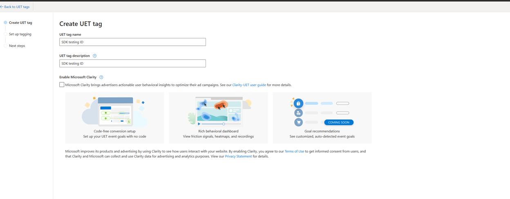
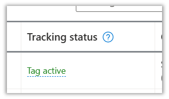
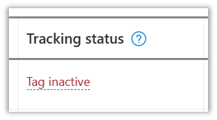
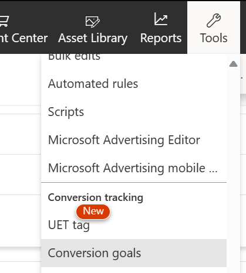
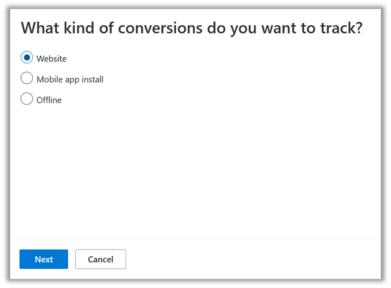
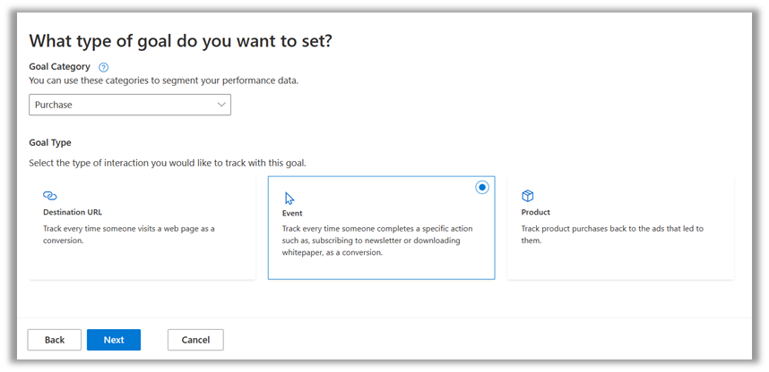
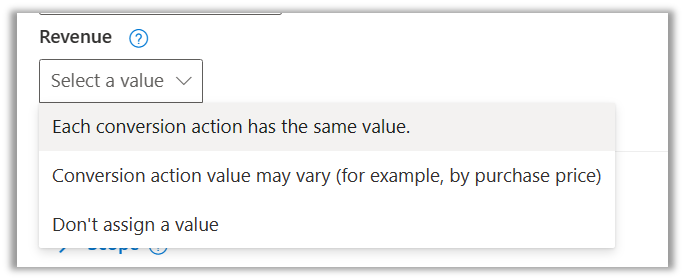
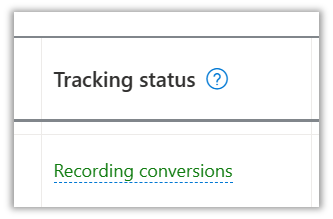
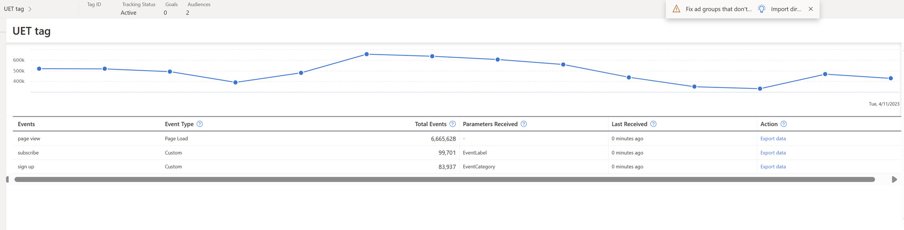

# Windows App UET SDK

Users are spending an increasing amount of time on the Microsoft Store app now more than ever. Some of their activities on the store app include browsing, searching for products, research on product details, and even completing purchases. Customers who spend a lot of time on the store app are often the most valuable audience to the advertiser.  

Much like user activity signals from UET JavaScript tags on the web, user signals from the store app are critical to help Microsoft Advertising identify users across channels, to understand their behavior to optimize campaign creatives and improve ad selection accuracy, relevance, and performance. Reporting on in-app signals and conversions in turn helps advertisers optimize ad targeting, accurately measure ad campaign outcomes, and see better yield for ad spend. 

## <a name="get-started"></a>Get Started - Windows App UET SDK

For the Microsoft Store app, we provide an SDK to fire UET events. However, this works slightly differently than web based UET. This guide shows you how to add app events to your new or existing app by integrating Windows App UET SDK to log user interaction events. For more information on web based Universal Event Tracking (UET) which is also a Microsoft framework, please refer to [Microsoft Ads web UET help documentation](https://help.ads.microsoft.com/#apex/ads/en/56681/2-500).

Before you can use Windows App UET SDK, you need to make sure you have the following prerequisites ready:  

- Publish your app or game on the Microsoft Store. If you haven’t published your app or game yet, start here.  
- Set up your Microsoft Advertising account. [Learn more about signing up](https://help.ads.microsoft.com/#apex/ads/en/53090/0).

## <a name="installation"></a>Installation

For Universal Windows Platform applications, [download the Windows App UET SDK NuGet package](https://www.nuget.org/packages/Microsoft.BingAds.UETSdk).

For Win32 applications, [download the Windows App UET SDK NuGet package](https://www.nuget.org/packages/Microsoft.BingAds.UETSdk.Win32).

For PWA applications, [download the Windows App UET SDK NPM package](https://www.npmjs.com/package/@bing-ads/uet-pwa-sdk).

<!-- ### <a name="requirements"></a>Requirements

You’ll need to have a UET tagID associated with your app. To create a new UET tag, see the [Universal Event Tracking help documentation](./universal-event-tracking.md#uet). 

> [!NOTE]
> You’ll need a separate UET tag ID for each surface where you track UET. If you already have a UET tag ID that you use to track events on a website, you’ll need to create a new one for your application. If you want to track events in more than one application, you’ll need to create a different UET tag for each application where you are tracking events.

 -->

## <a name="tracking-app-actions"></a>Tracking App Actions

To create an instance of Windows App UET SDK, you’ll need to call the constructor *uetSdk = new UETSdk(number tagId);* where tagID is your UET tagID. Once an instance of UET is created, the SDK will track launches of your app automatically. See the [UET dashboard](#uet-dashboard) section for more information about how you can track these launches.

Once your tag sends data about user actions in your application to Microsoft Advertising, the Tracking status for your tag will be “Tag active”.

> [!NOTE]
> It may take a few days for your tag to start sending data, as customers need to start activating & installing your application for this data to start flowing.



If your Tracking status is “Tag inactive”, Microsoft Advertising hasn't received customer activity through the UET tag in the last 24 hours. If you see this tracking status, you should verify that your UET tag is  implemented correctly.



You can skip directly to the [Recommended and Custom Goals via the trackGoal API](#custom-goals) if you are only trying to track the following actions:

- Application activation (first open after download)
- Application launches
- In-app purchases.
- In-app subscriptions.

If you need to track any other custom events in your application, you need to proceed to the following section, *Creating Conversion Goals*.  

### <a name="creating-conversion-goals"></a>Creating Conversion Goals

There are two automatically tracked events (activations and launches) with the UET tag and two recommended events (purchases and subscriptions) which Microsoft has already set up for all users. To see more about the recommended events, view the next section.

For any other custom events which you want to track, you’ll need to create custom conversion goals.

Conversion tracking measures the return on investment of your campaign by tracking the actions people take on your application after they click on your ad. When the action matches your conversion goal, it is counted as a conversion. [Learn more about conversion goals and custom events](./universal-event-tracking.md#conversiongoals).

For example, you may want to track in-app purchases so you can track the revenue your application generates after it is downloaded from an ad.

#### Create conversion goals for Microsoft Store ads

There are some unique steps you’ll need to take to create conversion goals that are specific for Microsoft Store ads.  

1. From the top menu, select **Tools** > **Conversion tracking** > **Conversion goals**.  

1. On the Conversion goals page, select **Create**.
1. Select the type of conversions you want to track.
    - You can choose *Website*, *Mobile app install* or *Offline*. For tracking conversions within Microsoft Store apps, select *Website*.  

1. Choose a *Goal category* and *Goal type* for your conversion goal. [Learn more about goal categories](https://help.ads.microsoft.com/#apex/ads/en/56952/2-500).
    - The goal category that you select won't affect how this is tracked. This category should be used by your team to understand the differences between your separate goals.  
    - For most goals in an application, you'll want to select *Event*. In the example of setting up an in-app purchase goal, we select *Event* because this in-app purchase happens when a user completes a specific action.  

    - You'll need to set a relevance value if you want to use this conversion goal to track revenue that is generated from your advertising campaign.  

1. Confirm that you have already set up your UET tag.
1. Install your event tag.
    - Learn more about [installing a UET tag](https://help.ads.microsoft.com/#apex/3/en/56688/2).

1. Finalize your conversion goal.

Once you have created a conversion goal, it will appear in the table on your Conversion goals page in the Microsoft Advertising UI. You can also see the number of conversions and the conversion revenue that has been generated by the goal on that page.  

When your conversion goal is complete and attached to a UET tag, the  Tracking status will update to "Recording conversions". This means that your UET tag has recorded at least one conversion in the last 7 days.



If your Tracking status is “No recent conversions”, your UET tag hasn’t received any conversions for the last 7 days. This might mean that you have created the goal incorrectly. If you see this status, you should confirm that your conversion is correctly implemented. 

> [!NOTE]
> Similar to the UET tag tracking status, you should give your conversion goals a few days to start recording conversions before you reach out to the support staff to confirm your conversion goal is correctly implemented.  

### <a name="custom-goals"></a>Recommended and Custom Goals via the trackGoal API

The Windows App UET SDK provides the trackGoal API for tracking recommended and custom events and goals. You can pair this custom event tracking with conversion goals to measure the ROI (return on investment) of your advertising campaign.

#### Recommended Events

Recommended Events are events which many advertisers care about, and which can be tracked without creating an additional conversion goal in the Microsoft Advertising UI. To track a custom event, you need to implement the trackGoal API in your application using the following parameters.  

The action parameter is predefined for in-app purchases (*inapp_purchase*) and subscriptions (*inapp_subscribe*). You can use the other parameters to track these events.

**In-App purchase and subscription recommended events**:

| Parameter | Value | Required? | Description |
| --- | -------------------------------- | ------- | ------- |
| action | *inapp_purchase* or *inapp_subscribe* | Yes | This action value must be used to enable in-app purchase metrics in reporting (and optimization once it becomes available). |
| label  | No recommendation | No | The advertiser can use this to differentiate between different purchase events. E.g., If the user can buy a single coin or a bag of coins in a game, they can use the label and category parameters to differentiate between these two different types of purchases. |
| category  | No recommendation | No | See above. |
| revenue  | Advertisers should fill this in with the expected revenue. | Yes | Passing the revenue value will enable in-app ROAS based metrics in reporting (and ROAS optimization once it becomes available).  |
| currencyCode  | No recommendation. The advertiser needs to fill this out if they fill in revenue. | Yes | E.g., "USD" |

**In-App subscription Recommended Event**:

| Parameter | Value | Required? | Description |
| --- | ----------- | ------- | ------- |
| action | *inapp_subscribe* | Yes | This action value must be used to enable in-app purchase metrics in reporting (and optimization once it becomes available). |
| label  | No recommendation | No | The advertiser can use this to differentiate between different purchase events. E.g., If the user can buy a single coin or a bag of coins in a game, they can use the label and category parameters to differentiate between these two different types of purchases. |
| category  | No recommendation | No | See above. |
| revenue  | Advertisers should fill this in with the expected revenue. | Yes | Passing the revenue value will enable in-app ROAS based metrics in reporting (and ROAS optimization once it becomes available).  |
| currencyCode  | No recommendation. The advertiser needs to fill this out if they fill in revenue. | Yes | E.g., "USD" |

#### Optional Parameter

These parameters help to capture richer user interaction data. These events are used in creating remarketing and dynamic remarketing lists and defining conversion goals. Here are some of the pages where these events could be applicable:  

- Homepage
- Category browse page
- Search results page
- Product display page
- Cart page
- Purchase confirmation page and others

Call the following to set custom goals: *uetSdk.TrackGoal (string action, string label, string category, float revenue, string currencyCode)*

Use these parameters when constructing UET requests:

| Parameter | Description |
| --- | ----------- |
| action | The name of the action taken on a webpage. E.g., “click”, “purchase”.|
| label  | A custom tag for an event or multiple events.|
| category  | A custom tag for the category of an event or multiple events.|
| revenue  | The income from a specific user action, such as “purchase”.|
| currencyCode  | A three-letter alphabetic code that represents the various currencies used throughout the world. E.g., “USD”.|

> [!NOTE]
> You can send *null* for these parameters if they are not available.

Once your conversion goal and trackGoal API information is set up, you can track conversions from the Conversion goals page in the Microsoft Advertising UI. This will give you the ability to track conversions, conversion revenue, and more.

*Insert screenshot of Conversion Goals dashboard here*  

## <a name="code-examples"></a>Code Examples

> [!NOTE]
> We currently support C# and C++11.

Here is an example of Windows App UET SDK usage in C# for a Universal Windows Platform app:

**Initialize Windows App UET SDK at application level on app launch by providing UET tagId.**

```C#
public sealed partial class App: Application 
    { 
        internal static UETSdk uetSdk; 

        public App() 
        { 
            this.InitializeComponent(); 
            this.Suspending =+ OnSuspending; 
        } 

        protected override void OnLaunched(LaunchActivatedEventArgs e) 
        { 
            uetSdk = new UETSdk(123456); // your UET tagId 
        } 
    } 
```

Here is an example of Windows App UET SDK usage in C++ for a Win32 app:

**Initialize Windows App UET SDK at application level on app launch by providing UET tagId.**

```cpp
using namespace Microsoft::BingAds::UETSdkWin32;
UETSdk* uetSdk = NULL;

int APIENTRY wWinMain(_In_ HINSTANCE hInstance,
    _In_opt_ HINSTANCE hPrevInstance,
    _In_ LPWSTR    lpCmdLine,
    _In_ int       nCmdShow)
        {
            uetSdk = new UETSdk(L"YourAppName", L"YourStoreId", 123456); 

            //  YourAppName: replace with your registryKey, all the data used by UET SDK will be stored in the registry - HKEY_CURRENT_USER\Software\[YourAppName] 

            //  YourStoreId: replace with your product (store) id

            //  123456: replace with your UET tag id
        } 
```

Here is an example of Windows App UET SDK usage in Javascript for a PWA app:

**Initialize Windows App UET SDK at application level on app launch by providing UET tagId.**

```javascript
import UETPWASDK from '@bing-ads/uet-pwa-sdk';

const uet = new UETPWASDK ({ 
    ti: "<tag_id>" 
});
```

**In order to track recommended events, make use of TrackGoal API of created SDK object.**

```C#
public sealed partial class MainPage : Page  
    {  
        private void Button_Click(object sender, RoutedEventArgs e)  
        {  
            //Recommended event purchase 
            App.uetSdk.TrackGoal("inapp_purchase", "Buy Coins", "Other", 5, "USD");  
        }
    }
```

```cpp
uetSdk->TrackGoal(L"inapp_purchase", L"Buy Coins", L"Other", 5, L"USD");
```

```javascript
uet.trackGoal("inapp_purchase", "Product XYZ", "ecommerce", 100, "USD");
```

**In order to track custom goals, make use of TrackGoal API of created SDK object.**

```C#
public sealed partial class MainPage : Page 
    { 
        private void Button_Click(object sender, RoutedEventArgs e) 
        { 
           App.uetSdk.TrackGoal("click", "Buy Coins", "Other", 5, "USD"); 
        } 
    } 
```

```cpp
uetSdk->TrackGoal(L"click", L"Buy Coins", L"Other", 5, L"USD");
```

```javascript
uet.trackGoal("click", "Buy coins", "other", 100, "USD");
```

### <a name="cpluspluswinrt"></a>Consuming UET SDK from C++/WinRT app

Follow these steps to reference C# UWP UET SDK from your C++/WinRT Application.

- Add a reference to the Nuget package of Microsoft.BingAds.UETSdk.

- In Visual Studio, open the shortcut menu for the {YourCppProject}project and choose **Unload Project** to open {YourCppProject}.vcxproj in the text editor.

- Copy and paste the following XML to the first *PropertyGroup* in {YourCppProject}.vcxproj:

```XML
<!-- Start Custom .NET Native properties -->
   <DotNetNativeVersion>2.2.9-rel-29512-01</DotNetNativeVersion>
   <DotNetNativeSharedLibrary>2.2.8-rel-29512-01</DotNetNativeSharedLibrary>
   <UWPCoreRuntimeSdkVersion>2.2.11</UWPCoreRuntimeSdkVersion>
   <!--<NugetPath>$(USERPROFILE)\.nuget\packages</NugetPath>-->
   <NugetPath>$(ProgramFiles)\Microsoft SDKs\UWPNuGetPackages</NugetPath>
<!-- End Custom .NET Native properties -->
```

The values for *DotNetNativeVersion*, *DotNetNativeSharedLibrary*, and *UWPCoreRuntimeSdkVersion* may vary depending on the version of Visual Studio. To set them to the correct values, open the %ProgramFiles(x86)%\Microsoft SDKs\UWPNuGetPackages and look at the sub-directory for each value in the table below. The %ProgramFiles(x86)%\Microsoft SDKs\UWPNuGetPackages\Microsoft.Net.Native.Compiler directory will have a sub-directory that contains an installed version of .NET native that starts with 2.2. In the example below, it is 2.2.9-rel-29512-01.

| MSBuild Variable | Directory |
| --- | ----------- |
| DotNetNativeVersion | %ProgramFiles(x86)%\Microsoft SDKs\UWPNuGetPackages\Microsoft.Net.Native.Compiler|
| DotNetNativeSharedLibrary  | %ProgramFiles(x86)%\Microsoft SDKs\UWPNuGetPackages\runtime.win10-x64.microsoft.net.native.sharedlibrary|
| UWPCoreRuntimeSdkVersion  | %ProgramFiles(x86)%\Microsoft SDKs\UWPNuGetPackages\Microsoft.Net.UWPCoreRuntimeSdk|

There are multiple supported architectures for Microsoft.Net.Native.SharedLibrary. Replace x64 with the appropriate architecture. For example, the arm64 architecture would be in the %ProgramFiles(x86)%\Microsoft SDKs\UWPNuGetPackages\runtime.win10-arm64.microsoft.net.native.sharedlibrary directory.

- Next, immediately after the first *PropertyGroup*, add the following (unaltered):

```xml
<!-- Start Custom .NET Native targets -->
  <!-- Import all of the .NET Native / CoreCLR props at the beginning of the project -->
  <Import Condition="'$(WindowsTargetPlatformMinVersion)' &gt;= '10.0.16299.0'" Project="$(NugetPath)\Microsoft.Net.UWPCoreRuntimeSdk\$(UWPCoreRuntimeSdkVersion)\build\Microsoft.Net.UWPCoreRuntimeSdk.props" />
  <Import Condition="'$(WindowsTargetPlatformMinVersion)' &gt;= '10.0.16299.0'" Project="$(NugetPath)\runtime.win10-x86.Microsoft.Net.UWPCoreRuntimeSdk\$(UWPCoreRuntimeSdkVersion)\build\runtime.win10-x86.Microsoft.Net.UWPCoreRuntimeSdk.props" />
  <Import Condition="'$(WindowsTargetPlatformMinVersion)' &gt;= '10.0.16299.0'" Project="$(NugetPath)\runtime.win10-x64.Microsoft.Net.UWPCoreRuntimeSdk\$(UWPCoreRuntimeSdkVersion)\build\runtime.win10-x64.Microsoft.Net.UWPCoreRuntimeSdk.props" />
  <Import Condition="'$(WindowsTargetPlatformMinVersion)' &gt;= '10.0.16299.0'" Project="$(NugetPath)\runtime.win10-arm.Microsoft.Net.UWPCoreRuntimeSdk\$(UWPCoreRuntimeSdkVersion)\build\runtime.win10-arm.Microsoft.Net.UWPCoreRuntimeSdk.props" />
  <Import Condition="'$(WindowsTargetPlatformMinVersion)' &gt;= '10.0.16299.0'" Project="$(NugetPath)\Microsoft.Net.Native.Compiler\$(DotNetNativeVersion)\build\Microsoft.Net.Native.Compiler.props" />
  <Import Condition="'$(WindowsTargetPlatformMinVersion)' &gt;= '10.0.16299.0'" Project="$(NugetPath)\runtime.win10-x86.Microsoft.Net.Native.Compiler\$(DotNetNativeVersion)\build\runtime.win10-x86.Microsoft.Net.Native.Compiler.props" />
  <Import Condition="'$(WindowsTargetPlatformMinVersion)' &gt;= '10.0.16299.0'" Project="$(NugetPath)\runtime.win10-x64.Microsoft.Net.Native.Compiler\$(DotNetNativeVersion)\build\runtime.win10-x64.Microsoft.Net.Native.Compiler.props" />
  <Import Condition="'$(WindowsTargetPlatformMinVersion)' &gt;= '10.0.16299.0'" Project="$(NugetPath)\runtime.win10-arm.Microsoft.Net.Native.Compiler\$(DotNetNativeVersion)\build\runtime.win10-arm.Microsoft.Net.Native.Compiler.props" />
  <Import Condition="'$(WindowsTargetPlatformMinVersion)' &gt;= '10.0.16299.0'" Project="$(NugetPath)\runtime.win10-arm64.Microsoft.Net.Native.Compiler\$(DotNetNativeVersion)\build\runtime.win10-arm64.Microsoft.Net.Native.Compiler.props" />
  <Import Condition="'$(WindowsTargetPlatformMinVersion)' &gt;= '10.0.16299.0'" Project="$(NugetPath)\runtime.win10-x86.Microsoft.Net.Native.SharedLibrary\$(DotNetNativeSharedLibrary)\build\runtime.win10-x86.Microsoft.Net.Native.SharedLibrary.props" />
  <Import Condition="'$(WindowsTargetPlatformMinVersion)' &gt;= '10.0.16299.0'" Project="$(NugetPath)\runtime.win10-x64.Microsoft.Net.Native.SharedLibrary\$(DotNetNativeSharedLibrary)\build\runtime.win10-x64.Microsoft.Net.Native.SharedLibrary.props" />
  <Import Condition="'$(WindowsTargetPlatformMinVersion)' &gt;= '10.0.16299.0'" Project="$(NugetPath)\runtime.win10-arm.Microsoft.Net.Native.SharedLibrary\$(DotNetNativeSharedLibrary)\build\runtime.win10-arm.Microsoft.Net.Native.SharedLibrary.props" />
  <Import Condition="'$(WindowsTargetPlatformMinVersion)' &gt;= '10.0.16299.0'" Project="$(NugetPath)\runtime.win10-arm64.Microsoft.Net.Native.SharedLibrary\$(DotNetNativeSharedLibrary)\build\runtime.win10-arm64.Microsoft.Net.Native.SharedLibrary.props" />
<!-- End Custom .NET Native targets -->
```

- At the end of the project file, just before the closing *Project* tag, add the following (unaltered):

```xml
<!-- Import all of the .NET Native / CoreCLR targets at the end of the project -->
  <Import Condition="'$(WindowsTargetPlatformMinVersion)' &gt;= '10.0.16299.0'" Project="$(NugetPath)\runtime.win10-x86.Microsoft.Net.UWPCoreRuntimeSdk\$(UWPCoreRuntimeSdkVersion)\build\runtime.win10-x86.Microsoft.Net.UWPCoreRuntimeSdk.targets" />
  <Import Condition="'$(WindowsTargetPlatformMinVersion)' &gt;= '10.0.16299.0'" Project="$(NugetPath)\runtime.win10-x64.Microsoft.Net.UWPCoreRuntimeSdk\$(UWPCoreRuntimeSdkVersion)\build\runtime.win10-x64.Microsoft.Net.UWPCoreRuntimeSdk.targets" />
  <Import Condition="'$(WindowsTargetPlatformMinVersion)' &gt;= '10.0.16299.0'" Project="$(NugetPath)\runtime.win10-arm.Microsoft.Net.UWPCoreRuntimeSdk\$(UWPCoreRuntimeSdkVersion)\build\runtime.win10-arm.Microsoft.Net.UWPCoreRuntimeSdk.targets" />
  <Import Condition="'$(WindowsTargetPlatformMinVersion)' &gt;= '10.0.16299.0'" Project="$(NugetPath)\Microsoft.Net.Native.Compiler\$(DotNetNativeVersion)\build\Microsoft.Net.Native.Compiler.targets" />
  <Import Condition="'$(WindowsTargetPlatformMinVersion)' &gt;= '10.0.16299.0'" Project="$(NugetPath)\runtime.win10-x86.Microsoft.Net.Native.Compiler\$(DotNetNativeVersion)\build\runtime.win10-x86.Microsoft.Net.Native.Compiler.targets" />
  <Import Condition="'$(WindowsTargetPlatformMinVersion)' &gt;= '10.0.16299.0'" Project="$(NugetPath)\runtime.win10-x64.Microsoft.Net.Native.Compiler\$(DotNetNativeVersion)\build\runtime.win10-x64.Microsoft.Net.Native.Compiler.targets" />
  <Import Condition="'$(WindowsTargetPlatformMinVersion)' &gt;= '10.0.16299.0'" Project="$(NugetPath)\runtime.win10-arm.Microsoft.Net.Native.Compiler\$(DotNetNativeVersion)\build\runtime.win10-arm.Microsoft.Net.Native.Compiler.targets" />
  <Import Condition="'$(WindowsTargetPlatformMinVersion)' &gt;= '10.0.16299.0'" Project="$(NugetPath)\runtime.win10-arm64.Microsoft.Net.Native.Compiler\$(DotNetNativeVersion)\build\runtime.win10-arm64.Microsoft.Net.Native.Compiler.targets" />
  <Import Condition="'$(WindowsTargetPlatformMinVersion)' &gt;= '10.0.16299.0'" Project="$(NugetPath)\runtime.win10-x86.Microsoft.Net.Native.SharedLibrary\$(DotNetNativeSharedLibrary)\build\runtime.win10-x86.Microsoft.Net.Native.SharedLibrary.targets" />
  <Import Condition="'$(WindowsTargetPlatformMinVersion)' &gt;= '10.0.16299.0'" Project="$(NugetPath)\runtime.win10-x64.Microsoft.Net.Native.SharedLibrary\$(DotNetNativeSharedLibrary)\build\runtime.win10-x64.Microsoft.Net.Native.SharedLibrary.targets" />
  <Import Condition="'$(WindowsTargetPlatformMinVersion)' &gt;= '10.0.16299.0'" Project="$(NugetPath)\runtime.win10-arm.Microsoft.Net.Native.SharedLibrary\$(DotNetNativeSharedLibrary)\build\runtime.win10-arm.Microsoft.Net.Native.SharedLibrary.targets" />
  <Import Condition="'$(WindowsTargetPlatformMinVersion)' &gt;= '10.0.16299.0'" Project="$(NugetPath)\runtime.win10-arm64.Microsoft.Net.Native.SharedLibrary\$(DotNetNativeSharedLibrary)\build\runtime.win10-arm64.Microsoft.Net.Native.SharedLibrary.targets" />
<!-- End Custom .NET Native targets -->
```

- Reload the project file in Visual Studio. To do this, in the Visual Studio Solution Explorer, open the shortcut menu for the {YourCppProject} project and choose **Reload Project**.

## <a name="logging"></a>Logging

We encourage a period of testing to make sure we are accurately sending data. Our team will help with this process. Typically, we look for validation and alignment on the format of data we’re receiving. We may need help with examining your integration to ensure we’re receiving and reporting data as accurately as possible. You can also look at the fiddler trace from your windows application to review the data that is sent.

## <a name="uet-dashboard"></a>UET Dashboard

The UET dashboard feature gives a live view of key metadata for any given tag. Customers can send this metadata to our data collection endpoint for simple troubleshooting. Users will be able to get aggregate insights and detailed data on all events and specific parameters that were sent in the last 30 days.  

Metadata includes the following:  

- Tag ID and Name
- Tag Status: active/inactive/receiving traffic
- Counts on goals and audiences tied to the tag

Payload will include:  

- Custom events with event type  
- Total event count that we receive per day
- Parameters received.

Customers will have the option of exporting this data to an excel file. You can reintegrate this data into the campaign.



## <a name="compliance"></a>Compliance

When you use Windows App UET SDK for the Microsoft Store app, our business terms require that you have an appropriate legal basis to collect and process users' information. Under GDPR and other EU (European Union) and CCPA data protection regulations, you are required to obtain end user consent before sending data via our SDK. Thus, you need to ensure that your SDK implementation meets these consent requirements.

## <a name="faq"></a>Frequently Asked Questions

Q: How can I validate that my conversion goals are working?

A: Once conversion goals are set up and you’ve validated that your app is sending events (in the UET Dashboard), make sure that the tracking status on your UET tag is "active", the tracking status on your conversion goals is "recording conversions", and you see the count increase on all conversions. You can also look at the fiddler trace from your application to validate the traffic that is sent to our UET endpoint. If none of these work for you, please reach out to support for help.  

## See Also
 
[FAQ: Universal Event Tracking](https://help.ads.microsoft.com/#apex/3/en/53056/2)
