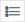

# Understand and use product groups

## What are product groups?

Once you create a Shopping campaign, Microsoft Advertising creates a default ad group. Within this ad group is a single product group that contains all the products from your Microsoft Merchant Center feed. This product group is what you use to bid on instead of keywords, and all the products within this product group use the same bid.

> [!NOTE]
> In order to understand product groups, first make sure you are familiar with both [Product ads](hlp_BA_CONC_AboutProductAds.md) and [Shopping campaigns](hlp_BA_CONC_BSC_Overview.md).

We recommend that you break down the single product group into smaller product groups so that each product group contains closely related products. This will help you manage which ads to show and when to show them. With product groups, you can narrow down the default group into a customized list of specific products and divide up to 5 levels for each product group.

## FAQ

- **Product group attributes**

  | Attribute | Description | What you need to know |
  | --- | --- | --- |
  | **Category** | Predefined product category **Example**: Software > Computer Software | - You can have up to 5 categories per offer. - Full list of taxonomy values: [All languages](https://advertiseonbingstatic-gadkdmcyhjcqgbbg.b02.azurefd.net/blob/bingads/media/library/docs/o/taxonomyfiles.zip) [Example feed file](https://advertiseonbing.z22.web.core.windows.net/blob/bingads/media/library/docs/bingmerchantcenter_example_feed.txt) |
  | **Brand** | Item’s manufacturer, brand, or publisher **Example**: Contoso **Requirements**: Alphanumeric 70-character limit 10-word limit | - Do not add your store name as the brand unless you manufacture the product. - Uploading an item for the first time will be pending review until the brand has been successfully crawled. Updating the brand of an existing item will be reverted to the pending review status until it has been successfully re-crawled. The review process can take up to 3 business days. |
  | **Condition** | Condition of item **Example**: new **Requirements**: Valid options: new; used; refurbished | - If no values are provided, the condition will be set to "new" by default. - 'New' products are brand new and have never been used, with the original packaging never opened. - 'Refurbished' products have been professionally restored, are free of defects, and come with a warranty. They may or may not have the original packaging. - 'Used' products are anything other than 'new' or 'refurbished,' where the products have been used previously, with the original packaging opened or missing. |
  | **Item ID** | A unique identifier for the item. **Example**: ISI1 **Requirements**: 50 Unicode character limit **Recommended**: ASCII only: alphanumeric, underscores (_) and dashes (-) | - ID must be unique for each item in your catalog per market. - If you have multiple feeds, the IDs of items across different feeds still need to be unique. - Special ASCII characters (e.g., asterisk (*), comma (,), backslash (\), ampersand (&), etc. are allowed. - The ID is the same as the merchant product ID (MPID). |
  | **Product type** | Your category of the item **Example**: Home > Electronics > DVD Player **Requirements**: Alphanumeric 750-character limit Delimiters: greater than [>] | You can have more than one product type if your item applies to more than one category. |
  | **Custom label** | Use to identify products for ad campaign filters **Example**: Best sellers, High ROAS, Winter **Requirements**: Alphanumeric Max 200 characters Single-value Up to 1000 unique values for each customer label attributes (up to 5000 labels total) | - You can use up to 5 labels per offer. - Use custom labels to add a value to the label, such as seasonal or sale items. |

- **How to create a product group**

  1. From the navigation menu on the left, hover over **Campaigns** and select **Campaigns**.
  1. From the grid, select the campaign for which you want to add a product group.
  1. From the grid, select the ad group for which you want to add a product group.
  1. From the grid, select the pencil icon  next to **All products**.
  1. From the **All products** panel on the right, select every item you'd like to add to the product group.
  1. Select **Save**.

- **How to subdivide product groups**

  1. From the navigation menu on the left, hover over **Campaigns** and select **Product groups**.
  1. Select the ad group that contains the product group you want to edit.
  1. Select + next to the product group.
  1. Select a category to narrow down for your new product group. You can continue to add up to 5 levels per product group.

- **How can I view different product groups?**

  1. From the navigation menu on the left, hover over **Campaigns** and select **Product groups**.
  1. Select the ad group that contains the product group and subdivided product groups you want to view.
  1. By default, the product groups are displayed in the table in the Hierarchy view. You can see how your product groups are organized by selecting the arrow next to the product group and drilling down to the subdivided product groups.    To view product groups in the List view, select the list icon  above the table. This view lets you see your product groups across an entire account, campaign, or ad group from the table.    You can hover over the product group to quickly see all the products that are included in the product group.

- **How can I view all products in my feed file?**

  1. From the navigation menu on the left and hover over **Campaigns**.
  1. Select **Products**.

- **How do I download my feed file?**

  1. From the navigation menu on the left, select **Merchant Center** > **Feeds**.
  1. Choose the desired feed and select **Download feed**.

- **How do I filter product groups?**

  1. From the navigation menu on the left, hover over **Campaigns** and select **Product groups**.
  1. Select the ad group that contains the product groups you want to filter.
  1. Select **Add filter**.
  1. Choose from the filter options and then select **Apply**.
  1. Select **Save**, and then in the box, enter the name.
  1. To apply a saved filter:

     - From the navigation menu on the left, select **Campaigns**.
     - From the page menu, select the page you want to apply saved filters to.
     - Select **Add filter** and under **Saved filters** choose the saved filter you would like to apply.

- **How do I make bulk changes to my product group's bids?**

  You can make bulk changes to your product groups at the ad group, campaign, or account level.

  1. From the navigation menu on the left, hover over **Campaigns** and select **Product groups**.
  1. Select the checkbox next to the product groups you want to update.
  1. Select **Edit** and then **Change bids**.
  1. Increase or decrease the bid by percentage, with a maximum or minimum bid option.
  1. (Optional) Select **Preview** to see what will change.
  1. Select **Save**.

- **About product group performance data**

  - Structural changes to product groups, like updating or deleting product groups, appear immediately in the table.
  - Structural changes often necessitate the redistribution of existing performance data across the new structure. Once the data has been reprocessed and is up to date, you will no longer see the alert above the table.

- **How do I manage and exclude specific item IDs in Performance Max campaigns?**

  1. From the navigation menu on the left, select **Campaigns** and select the Performance Max campaign you want to modify.
  1. Select **Asset groups**.
  1. Exclude the item in the following ways:

     - In the Asset Groups column, you can exclude specific item IDs by creating or modifying your asset groups.
     - You can toggle off the products you no longer wish to promote.
     - You may need to subdivide your products down to the item ID level.

- **What you need to know**

  - There is a one to one relationship between ad groups and product groups. In other words, each ad group has one product group and vice versa.
  - You can view your product groups on the **Product Group** tab within each ad group.
  - When viewing your product group, if there is a small triangle to the left of an item in the **Product Group** column, that row has been divided further by some other attribute. Select the triangle to expand that row and see the more granular segments.
  - Remember to "exclude" items that you don't want in your product group.

    To exclude, navigate to your campaign. Choose an ad group > **Product groups**. From the Product group column, next to "Everything else in 'All products'," select the pencil icon  from the Bid column. Choose **Exclude**.
  - You can narrow down a product group in your catalog feed up to 5 levels. For example, Office supplies > Office instruments > Writing and drawing instruments > Pens and pencils > Pens > New
