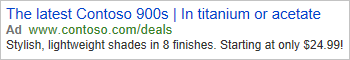
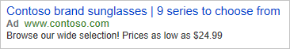
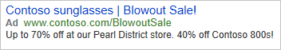
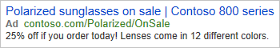
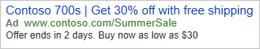

# About ad customizer feeds

> [!IMPORTANT]
> - **After February 1, 2023, you will no longer be able to create new or edit existing expanded text ads.** For more information, see [About Responsive Search ads](hlp_BA_CONC_ResponsiveSearchAds.md).
> - For more information about ad customizers for Responsive Search ads, see [About ad customizer for Responsive Search ads](hlp_BA_CONC_AdCustomizer_RSA.md).
> - Your scheduled feeds will continue to run and existing expanded text ads using ad customizer feeds will continue to serve. You'll be able to view reports on their performance.
> - You'll still be able to pause, run, or remove your existing ad customizer feeds.
> - > [!NOTE]
>   > Starting on August 31, 2023, we'll remove all unused ad customizer feeds that haven't been referenced in expanded text ads for more than three months. This will not impact any ads that are currently serving.
> - [Learn more about this change](https://go.microsoft.com/fwlink/?linkid=2208402)

With ad customizers, your ads can dynamically update themselves to appeal to specific customers. All it takes is uploading an ad customizer feed that tells us what information you want to insert into your ads under which circumstances.

The setup for ad customizers for Expanded text ads is different from Responsive Search ads. [Learn more about ad customizer for Responsive Search ads](hlp_BA_CONC_AdCustomizer_RSA.md).

## Why use ad customizer feeds?

- **Save time**: Transform a single text ad into hundreds of variations without having to manually update the ad.

- **More relevant ads**: Customize ads based on what customers are searching for, when they're searching for it, where they are, what device they're using, and more.

- **Better results**: See higher click-through and conversion rates.

- **Tip**: Leverage other dynamic text, number, price, and date/time fields in the ad copy with [dynamic text parameters](hlp_BA_CONC_AboutParameters.md).

  

## How ad customizer feeds work

An ad customizer feed is a spreadsheet. In this spreadsheet, each column is an attribute that tells Microsoft Advertising one of two things:

| Attribute type | What it tells Microsoft Advertising |
| --- | --- |
| **Custom attribute** | What information about your products or services you want to insert into your ads |
| - **Targeting attribute**   - **Standard attribute** | Under what conditions each piece of information should be inserted into your ads |

- **About custom attributes**

  You can define custom attributes to insert any kind of information you like into your ads. Each custom attribute will need a unique name, followed by the attribute type in parentheses.

  There are four different types of custom attributes you can use:

  | Custom attribute type | For example | Column header must appear like this | Accepted values |
  | --- | --- | --- | --- |
  | **Text** | Product names, product categories, descriptions | Name (text) (for example, "Shoes (text)") | Any letters, numbers, or symbols |
  | **Number** | Inventory count, number of colors available | Name (number) (for example, "Colors (number)") | Any whole number |
  | **Price** | Product cost, sale discount | Name (price) (for example, "Base_Price (price)") | Any number (including decimals) and valid currency characters |
  | **Date** | Event start time, last day of a sale | Name (date) (for example, "Sale_Date (date)") | yyyy/mm/dd hh:mm:ss (24-hour time; the hh:mm:ss is optional) |

  > [!NOTE]
  > You cannot give a custom attribute the same name as any standard attribute: Device preference, Scheduling, Start date, End date, or Custom ID.

- **About targeting attributes**

  Whereas custom attributes tell us what to insert into your ads, targeting attributes tell us *when* to insert that information. There are six different types of targeting attributes:

  | Targeting attribute type | Column header must appear like this | Accepted values | Note |
  | --- | --- | --- | --- |
  | **Target keyword** | Target keyword | Enter the keyword with your desired match-type syntax: - **Broad match**: *keyword* - **Phrase match**: *"keyword"* - **Exact match**: *\[keyword\]* | You can target keywords either with this attribute or with the **Target keyword text** and **Target keyword match type** attributes in conjunction. |
  | **Target keyword text** | Target keyword text | The keyword you want to target (*without* match type punctuation formatting). | This attribute can only be used in conjunction with the **Target keyword match type** attribute. |
  | **Target keyword match type** | Target keyword match type | "Broad", "Phrase", or "Exact" | This attribute can only be used in conjunction with the **Target keyword text** attribute. |
  | **Target ad group** | Target ad group | Existing ad group name | To target by ad group, you need to use both **Target ad group** and **Target campaign** attributes. |
  | **Target campaign** | Target campaign | Existing campaign name |  |
  | **Target location** | Target location | Name of location (English only) | - Location names can be entered in any of the following formats: Miami, FL Miami,Florida,United States Miami \| Florida \| United States - If you want to target only people *physically in* a location, you will need to use the **Target location restriction** attribute as well. |
  | **Target location ID** | Target location ID | A numeric Microsoft Advertising geographical location code. | - [How to download the geographical location code file.](https://go.microsoft.com/fwlink/?linkid=536556) - If you are using this attribute, do not also use the **Target location** attribute. - If you want to target only people *physically in* a location, you will need to use the **Target location restriction** attribute as well. |
  | **Target location restriction** | Target location restriction | "Physical location" or empty | This attribute can only be used in conjunction with the **Target location** or **Target location ID** attribute. |
  | **Target audience ID** | Target audience ID | Existing Microsoft Advertising audience ID (for any audience type supported by Microsoft Advertising) | - Audience IDs can be found by hovering over **Campaigns** in the navigation menu on the left, and selecting **Audiences**. - [Available in-market audiences are listed here](https://go.microsoft.com/fwlink/?linkid=872520). |

- **About standard attributes**

  Standard attributes are advanced targeting configurations:

  | Standard attribute type | Column header must appear like this | Accepted values | Note |
  | --- | --- | --- | --- |
  | **Device preference** | Device preference | "mobile" or "all" |  |
  | **Scheduling** | Scheduling | "[day of the week] - [day of the week]" or "[day of the week], [start time] - [end time]"  Day of the week = "Monday", "Tuesday", "Wednesday", "Thursday", "Friday", "Saturday", or "Sunday"  Start/end time = yyyy/mm/dd hh:mm:ss (24-hour time) | If you wanted to schedule from 9:00 AM to 5:00 PM on Mondays, for example, you would enter "Monday, 09:00:00 - 17:00:00".  If you want to schedule for multiple days, separate your days with a semicolon. For example, you could schedule for both Monday and Tuesday using "Monday, 09:00:00 - 17:00:00; Tuesday, 09:00:00 - 17:00:00".  For start/end times, you can omit the hh:mm:ss part to set the time as midnight at the beginning of the day. |
  | **Start date** | Start date | yyyy/mm/dd hh:mm:ss (24-hour time) | You can omit the hh:mm:ss part to set the start time as midnight at the beginning of the day. |
  | **End date** | End date | yyyy/mm/dd hh:mm:ss (24-hour time) | You can omit the hh:mm:ss part to set the end time as midnight at the beginning of the day. |
  | **Custom ID** | Custom ID | Any combination of letters and numerals | Use this attribute to create your own identifying IDs for feed items. If used, a feed item will have two IDs: a Custom ID and an Item ID (which is automatically assigned by Microsoft Advertising). |

## Examples of ad customizers in action

In these examples, let's say you sell sunglasses.

Ad customizers appear in Microsoft Advertising in the following syntax: {=FeedName.Attribute}. So, if your feed name is "Sunglasses" and your attribute name is "Type," the syntax will be {=Sunglasses.Type}.

- **Target by keyword**

  Let's say you you want to highlight specific sunglasses features, depending on what a customer searches for. You might have a row of your ad customizer feed look like this:

  | Target keyword | Product (text) | Materials_Lightweight (text) | Description_Lightweight (text) | Finishes (number) | StartPrice (price) |
  | --- | --- | --- | --- | --- | --- |
  | **lightweight sunglasses** | Contoso 900 | titanium or acetate | Stylish, lightweight shades | 8 | $24.99 |

  Then...

  | If you set up your ad like this in Microsoft Advertising... | ...it could look like this for customers who searched for "lightweight sunglasses" |
  | --- | --- |
  | **The latest {=Sunglasses.Product}s In {=Sunglasses.Materials_Lightweight} www.contoso.com/deals {=Sunglasses.Description_Lightweight} in {=Sunglasses.Finishes} finishes. Starting at only {=Sunglasses.StartPrice}!** |  |

- **Target by campaign or ad group**

  OK, now let's say your ad campaign has a different ad group for each brand of sunglasses you sell. You've found that customers who search for a specific series of a brand of sunglasses often end up purchasing a different series. So, you want to highlight your series options within your brand's ad group. You might have a row of your ad customizer feed look like this:

  | Target campaign | Target ad group | Brand (text) | Series (number) | StartPrice (price) |
  | --- | --- | --- | --- | --- |
  | **Sunglasses** | Contoso 900 | Contoso | 9 | $24.99 |

  Then...

  | If you set up your ad like this in Microsoft Advertising... | ...it could look like this for customers who searched for "contoso 900" |
  | --- | --- |
  | **{=Sunglasses.Brand} brand sunglasses {=Sunglasses.Series} series to choose from www.contoso.com Browse our wide selection! Prices as low as {=Sunglasses.StartPrice}** |  |

- **Target by location**

  Uh-oh! It was a cloudy summer in Portland and now your Portland store has way too many Contoso brand sunglasses. Time for a big sale to move that particular store's inventory. You might have a row of your ad customizer feed look like this:

  | Target location | Brand (text) | BlowoutSale_1 (text) | BlowoutSale_2 (text) |
  | --- | --- | --- | --- |
  | **Portland, Oregon** | Contoso | Up to 70% off at our Pearl District store. | 40% off Contoso 800s! |

  Then...

  | If you set up your ad like this in Microsoft Advertising... | ...it could look like this for customers who searched for "contoso portland" |
  | --- | --- |
  | **{=Sunglasses.Brand} sunglasses Blowout Sale! www.contoso.com/BlowoutSale {=Sunglasses.BlowoutSale_1} {=Sunglasses.BlowoutSale_2}** |  |

- **Target by audience**

  Now, let's say you have a remarketing list of customers who looked at a specific type of sunglasses on your website. You might have a row of your ad customizer feed look like this:

  | Type (text) | Product (text) | Discount (text) | Colors (number) | Target audience ID |
  | --- | --- | --- | --- | --- |
  | **Polarized** | Contoso 800 | 25% off | 12 | 12345678 |

  Then...

  | If you set up your ad like this in Microsoft Advertising... | ...it could look like this for customers who were in this remarketing list |
  | --- | --- |
  | **{=Sunglasses.Type} sunglasses on sale {=Sunglasses.Product} series www.contoso.com/{=Sunglasses.Type}/OnSale {=Sunglasses.Discount} if you order today! Lenses come in {=Sunglasses.Colors} different colors.** |  |

- **Use ad customizers within countdowns**

  If you were having a sunglasses sale for a limited time, you could combine the power of ad customizers and [countdowns](hlp_BA_CONC_Countdown.md). You might have a row of your ad customizer feed look like this:

  | Product (text) | Promo (text) | End_by (date) | StartPrice (price) |
  | --- | --- | --- | --- |
  | **Contoso 700** | 30% off with free shipping | 2019/08/14 23:59:59 | $30 |

  Then...

  | If you set up your ad like this in Microsoft Advertising... | ...it could look like this for customers who searched for "contoso sunglasses" on August 12, 2019 |
  | --- | --- |
  | **{=Sunglasses.Product}s Get {=Sunglasses.Promo} www.contoso.com/SummerSale Offer ends in {=COUNTDOWN(Sunglasses.End_by)}. Buy now as low as {=Sunglasses.StartPrice}** |  |

## Layout of an ad customizer feed

> [!NOTE]
> For details on uploading and managing ad customizer feeds, take a look at [Business data feeds](hlp_BA_PROC_Feeds_WorkingWith.md).

## Adding ad customizers to Expanded text ads

You can add ad customizers to any Expanded text ad field except the Final URL.

1. When creating or editing an Expanded text ad, enter an open brace ( { ) where you want the ad customizer to appear.
1. In the resulting dropdown menu, select **Ad customizer**.
1. In the resulting dropdown menu, choose the appropriate ad customizer feed.
1. In the resulting dropdown menu, choose the appropriate custom attribute from that feed.
1. **Default text** is optional. If you want your ad to appear *even if the circumstances defined by the feed's targeting and/or standard attributes are not met*, enter a word, phrase, or number to appear instead of the custom attribute value.

   > [!NOTE]
   > If a single ad customizer in an ad has default text defined, every other ad customizer in the same ad must also have default text defined.
1. Select **Save**.

> [!NOTE]
> The ad customizer will appear in Microsoft Advertising in the following syntax: {=FeedName.Attribute:DefaultText}. So, if your feed name is "Accessories", your attribute name is "Type," and your default text is "sunglasses," the syntax will be {=Accessories.Type:sunglasses}.

- **How to add ad customizer feeds to ad text manually**

  You can also add an ad customizer feed to ad text manually, either by typing directly in the **Create ad** input boxes by using a [bulk upload](hlp_BA_CONC_AboutBulk.md) spreadsheet or by using [Microsoft Advertising Editor](hlp_BA_CONC_AboutDesktop.md).

  To make sure you enter it correctly, let's look at the components of an ad customizer feed's syntax:

  ### {=FeedName.Attribute:DefaultText}

  | Component | What you need to know |
  | --- | --- |
  | **{ ... }** | **Mandatory**. The entire ad customizer syntax must be within a pair of braces (also called braces). |
  | **=FeedName** | **Mandatory**. An equals symbol immediately followed by the name you gave your ad customizer feed. |
  | **.Attribute** | **Mandatory**. A period immediately followed by the name you gave your custom attribute. |
  | **:DefaultText** | **Optional**. If you want your ad to appear—even if the circumstances defined by the feed's targeting and/or standard attributes are not met—enter a colon immediately followed by a word, phrase, or number to appear instead of the custom attribute value. Note: If a single ad customizer in an ad has default text defined, every other ad customizer in the same ad must also have default text defined. |
