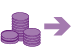

# What are my billing options? Pay now or pay later

Microsoft Advertising is a pay-per-click (PPC) advertising service, which means we charge you each time your ad is clicked. There are two main ways to pay for those charges: prepay and postpay.
<!--
| Column 1 | Column 2 | Column 3 |
| --- | --- | --- |
| **Prepay** | Add funds to your account and have charges deducted from those funds. |  |
|  |  |  |
| **Postpay** | Pay on a regular basis after charges accrue. There are two postpay billing options: |  |

| Column 1 | Column 2 | Column 3 |
| --- | --- | --- |
|  |  |  |

| Column 1 | Column 2 | Column 3 |
| --- | --- | --- |
| ****Threshold**
        Pay with a card when you reach your billing threshold amount or on your monthly billing date, whichever comes first.** |  | **Monthly Invoice**
        Get credit approval to charge up to a specified monthly amount and pay using a monthly invoicing process. |

This article covers postpay threshold and prepay accounts. Interested in monthly invoice billing? Learn more [about monthly invoicing](hlp_BA_CONC_MonthlyInvoiceBilling.md).

## Postpay threshold vs. prepay: What's the difference?

The big difference between a and a prepay account is whether you pay after charges have accrued or before, but there are a few other smaller differences described below.

> [!NOTE]
> > [!NOTE]
> > Partial payments are only supported for monthly invoice accounts, not for prepay or postpay threshold accounts.
-->

|  | Postpay threshold | Prepay |
| --- | --- | --- |
| ****When do I pay?**** | **Pay later.** As your ads are clicked, charges accumulate. You pay for those charges either on your monthly billing date or when you reach your billing threshold, whichever comes first. Your monthly billing date is the monthly anniversary of your sign-up date for Microsoft Advertising. When met, the billing threshold is a set amount that triggers billing for advertising costs. Learn [how billing threshold works](hlp_BA_CONC_BillingThreshold.md). | **Pay in advance.** As your ads are clicked, charges are deducted from funds that you've added to your account. When you run out of funds, your account is paused until more money is added. You can avoid having your account paused by [making automatic payments when your remaining balance gets low](hlp_BA_PROC_AutoRecharge.md). |
| ****How do I pay?**** | **Add a valid credit card and set it as the primary payment method.** When you set up a postpay account, you must add a credit card or other valid form of payment and set it as the primary payment method for your account. Learn [how to add a credit card](hlp_BA_PROC_AddBilling.md). | **Add funds to your account.** When you set up a prepay account, in addition to adding a payment method and setting it as primary, you must add funds to your account. Learn [how to add funds to a prepay account](hlp_BA_PROC_AddFunds.md). |
| ****What forms of payment can I use?**** | **Credit card and debit card.** Valid forms of payment depend on your account currency and country settings. For specifics on which form of payment you can use, see [Choosing a payment method for Microsoft Advertising](hlp_BA_CONC_PaymentMethodsV2.md). We may initiate an authorization hold on your card for the estimated amount of the advertising fee. This hold will be removed either when the time limit for the hold is up (usually, it's 7 days) or upon receipt of funds for the final transaction, whichever comes first. | **Credit card, debit card, PayPal (only accounts with Canadian dollar, euro, Mexican peso, Norwegian krone, UK pound, or US dollar set as the currency), bank wire transfer, etc.** Valid forms of payment depend on your account currency and country settings. For specifics on which form of payment you can use, see [Choosing a payment method for Microsoft Advertising](hlp_BA_CONC_PaymentMethodsV2.md) |
| ****Which is faster?**** | **Postpay is generally faster.** Setting up a postpay threshold account with a credit or debit card is the fastest way to get your advertising campaign up and running. | **Prepay can take more time.** *Credit/debit card:* Typically immediate, but can take up to 24 hours. *Bank transfer:* Typically 5 days after bank transfer is complete. *Other country-specific payment types, such as Boleto Bancario, virtual bank account, and SEPA direct debit:* Typically 5 days after funds are transferred. |
| ****Can I use a backup payment method?**** | **Yes.** If you have a postpay account, you can set a backup payment method, so that if your primary payment method doesn't work (for example, the card expires), your account won't be put on hold and your ads will continue to run. Learn [how to add a backup payment method](hlp_BA_PROC_AddBackupPM.md). | **No.** |
| ****Can I use auto-recharge?**** | **No.** | **Yes, if you are paying with an online payment method, for example a credit card.** You can set up auto-recharge so that funds are added to your prepay account whenever you reach 20% of the recharge amount. Learn how to [set up auto-recharge for a prepay account](hlp_BA_PROC_AutoRecharge.md). With auto-recharge, you are required to set a primary payment method, so that we know which card to charge when your account funds run low. |
| ****Can I have an agency manage this account?**** | **Yes.** | **Yes.** |

## Monthly invoice billing: How do I sign up?

To find out if you qualify for monthly invoicing and to sign up, [contact support](https://go.microsoft.com/fwlink/?linkid=398371). Existing postpay threshold accounts can be rolled over into an invoiced account. New accounts can also qualify for invoicing. Learn more [about monthly invoice billing](hlp_BA_CONC_MonthlyInvoiceBilling.md).

## When will I be charged?

Your account creation date will also be your monthly billing date. For example, if you create an account on May 5, your billing date will be the 5th of each month. However, if you signed up on a date that isn't in every month, you'll be billed on the last day of the month. For example, if you signed up on March 31, you'll be billed on April 30, May 31, and so on. You won't be able to change the billing date.

## What if I want to change from prepay to postpay or vice versa?

You can switch from prepay to postpay threshold and vice versa at any time. [Learn how](hlp_BA_PROC_SwitchPaymentSettingV2.md).

## Related videos

- [Understanding billing and payment](https://www.youtube.com/watch?v=YfyZuoLOCdE)
